3D Visualization
=============================

In this section the 3D visualization concepts are described. This section only focuses the **use** of existing 3D-objects in the Enviroment. The creation of new 3D Objects for Jadex 3D is a complex topic which will later in a different chapter

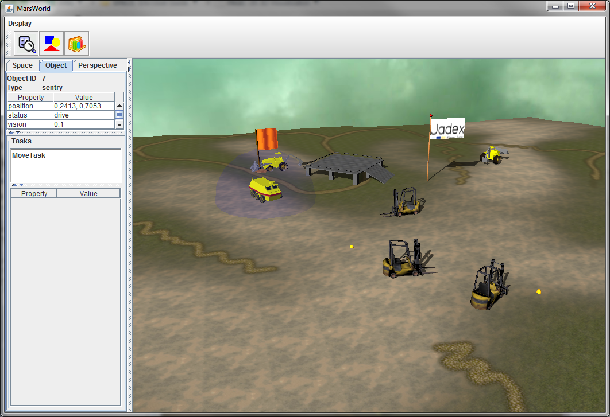   
*Figure 1 A running 3D Example*

Coordinate System
------------------------------

The coordinate system consists of:

-   The origin, a single point in space.
    - This point is always at coordinate (0,0,0)
-   Three coordinate axes that are mutually perpendicular, and meet in the origin.
    - The X axis is "right/left"
    -  The Y axis is "up/down"
    - The Z axis is "towards you/away from you"

   
*Figure 2 A 3D Coordinate System*

Every point in 3D space is defined by its (x,y,z) coordinates. The data type for vectors is Vector3Double or Vector3Int.


**Drawable3d declaration part of XML schema**
----------------------------------------------------------

A **drawable3d **represents the visual counterpart of a space object type. As can be seen in the schema part above it consists of property elements and arbitrary many geometrical meshes composing the look of the object (sphere, box, cylinder, dome, torus, object3d, arrow, text3d, sky, terrain, rndterrain and sound3d).

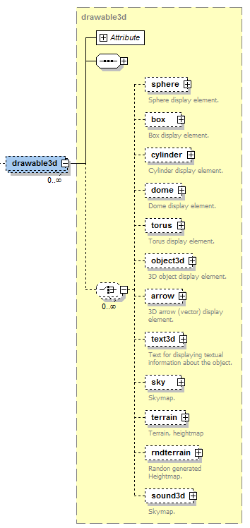


The primitve mesh-elements are sphere, box, cylinder, dome, torus and object. Complex mesh types are object3d (which loads a complex 3d mesh from a file) and terrain (generator for a 3d-terrain ground). Text3d, sky and sound3d can be considered as special types. We will describe all these types in detail later.
The drawable3d itself is further specified by associating it to a specific objecttype.
Additionally, the width, height and rotation can be set. Each geometrical mesh based shape contained in the drawable is of type **drawableelement **and has the attributes described in the list below. 


For all Elements, the **Drawable3d **and the Visual Objects inside have at least the three Attributes Position, Size and Rotation.

For instance, if you set the Size for the **Drawable3d** all Objects inside are influenced. If you set the Size for just one Visual Object only the Object is influenced relative to the size value of the **Drawable3d**.


|Name | Default Value | Description | Type|
|-----|---------------|-------------|-----|
| **position** | Vector3Double(0,0,0) | An IVector3 or String for the 3d position of the object (relative to the drawable position). <br> *Use this or x, y, z instead (then you have to set all three)* | Vector3Int <br> Vector3Double |
| x | 0 | The x value of the position | int / double |
| y | 0 | The y value of the position | int / double |
| z | 0 | The zvalue of the position  | int / double |


|Name | Default Value | Description | Type|
|-----|---------------|-------------|-----|
| **size**  | Vector3Double(1,1,1) | An IVector3 or String for the shape size (relative to the drawable size). <br> If it is a String it must be a property name of the drawable the value is bound to. <br> Use this or width, height, depth instead (then you have to set all three).|  String <br> Vector3Int <br>Vector3Double  |                                
| width  | 1 | The height value of the size   | int / double |
| height | 1 | The depth value of the size    | int / double |
| depth  | 1 | The depth value of the size    | int / double |


|Name | Default Value | Description | Type|
|-----|---------------|-------------|-----|
| **rotation** | Vector3Double(0,0,0) |  An IVecor3 or String for the rotation according to x, y, z axis (relative to the drawable rotation) in radians. <br> *Use this or rotatex, rotatey, rotatez instead (then you have to set all three)*. | String<br>Vector3Double|
| rotatex | 0 | The rotation value along the x axis | int / double |
| rotatey | 0 | The rotation value along the y axis | int / double |
| rotatez | 0 | The rotation value along the z axis | int / double |


Beside this very basic Attributes all the Visuals (not the Drawable3d itself) have these three attributes:


|Name | Default Value | Description | Type|
|-----|---------------|-------------|-----|
|**shadowType** |"Off"  |A String that indicates if this object should be rendered with shadows. Values are recieve, cast and off. If you choose recieve this object can recieve shadows from every object that cast a shadow. |String|
|**color**|  "#FFFFFF" | The color of the visual object. Notation is in RGB, # following by the Red, Green and Blue Value in Hex (from 00 to FF). So pure Red is for example: "#FF0000" | String|
|**texturepath**| "" |  If you want to use a texture instead of just a color for the primitive put the Path to it here. You can combine color and texturepath to juse a coloration for the texture. If you want the texture unchanged dont set a color value | String |


Moreover, some elements have certain special properties, which are not applicable to all Drawables. The easiest way to find out about the properties is to use eclipse's auto-complete to gain an overview. We will describe this special Attributes in detail for each visual Object if necessary in the list of predefined visuals below.

### Rotation in Detail

You can use frequently used predifined rotations for every angle. The predefined values are 45, 90, 135, 180, 235 and 270 degree. To use it just type rotation="$DEG{value}{x|y|z}".
For example if you want to rotate 180 degree on the y-angle just type rotation="$DEG180y".


To define the rotation by yourself just remember its defined in radians. To use degree you have to calculate it by Pi/180*value. For example if you want to rotate 40 degree on x, 170 degree on y and 80 degree on z just type:
rotation="new Vector3Double((Math.PI/180)*40, (Math.PI/180)*170, (Math.PI/180)*80)"

The three Dimensions are explained in the Picture below:

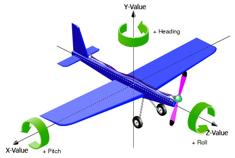

### ShadowType Example

In this example we have four objects who cast shadows and one plane below this objects to Receive the shadows.
You can see the result in the rendered Picture.

```xml
<env:drawable3d objecttype="character" hasSpaceobject="true" width="1" height="1" depth="1" x="5" y="0" z="5">
 <env:box width="10" height="0.01" depth="10" x="0" y="1" z="0" color="#FFFFFF" shadowtype="Receive"/>
 <env:dome width="1" height="1" depth="1" x="0" y="1.75" z="0" color="#7FFF00" shadowtype="Cast" />
 <env:dome width="1" height="1" depth="1" x="5" y="1.75" z="5" color="#FFFF00" shadowtype="Cast" />
 <env:cylinder width="1" height="1" depth="1" x="5" y="1.75" z="0" color="#0000FF" shadowtype="Cast" />
 <env:cylinder width="1" height="1" depth="1" x="0" y="1.75" z="5" color="#FF0000" shadowtype="Cast"/>
</env:drawable3d>
```


List of usable predefined 3D-Primitives
----------------------------------------------------

Now we describe the easiest Objects you can use to make an jump-start for you Application possible. These Objects are sphere, box, cylinder, dome, torus and arrow. You can replace them later to use complex 3d-Objects you create or get from external sources.

### Sphere

Additional Values: (none)

Example:


```java
<env:drawable3d width="1" height="1" depth="1" rotation3d="true">
  <env:sphere width="1" height="1" depth="1" color="#FF0000">
  </env:sphere>
</env:drawable3d>
```


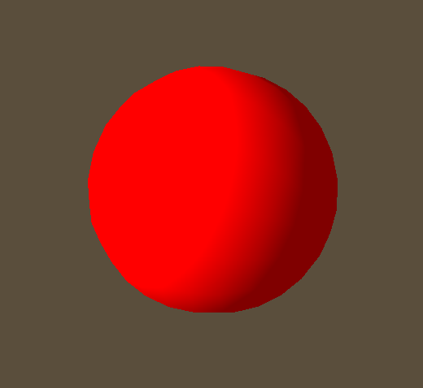

### Box

Additional Values: (none)

Example:

```xml
<env:drawable3d objecttype="character" width="1" height="1" depth="1" rotation3d="true">
   <env:box width="1" height="1" depth="1" color="#0000FF">
   </env:box>
</env:drawable3d>
```


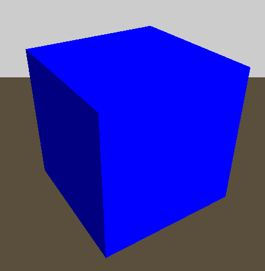

### Cylinder

Additional Values: **radius**

|Name | Default Value | Description | Type|
|-----|---------------|-------------|-----|
| **radius** | 1 | The Radius of the Cylinder. Default is 1. You can change the apperance for the cylinder by changing the height and/or the radius. |  Double |

As you can see from the example, you have to rotate a Cylinder 90 degree on the x oder z axis to get it in a "standing" position.

You only need the **height **and the **radius **value to define a Cylinder.


Example:

```xml
<env:drawable3d objecttype="character" width="1" height="1" depth="1" x="5" y="0" z="5">
 <env:cylinder height="1" radius="2" rotation="$deg90x" x="0" y="1.75" z="0" color="#000000"/> <!-- Black one -->
 <env:cylinder height="2"  radius="0.3" rotation="$deg90y" x="5" y="1.75" z="5" color="#FFFF00"/> <!-- Yellow one -->
 <env:cylinder height="1"  x="5" y="1.75" z="0" color="#0000FF"/> <!-- Blue one -->
 <env:cylinder height="5" radius="0.5" rotation="$deg90x" x="0" y="1.75" z="5" color="#FF0000"/> <!-- Red one -->
 <env:cylinder height="0.01"  radius="10" rotation="$deg90x" x="0" y="1" z="0" color="#FFFFFF"/>
</env:drawable3d>
```


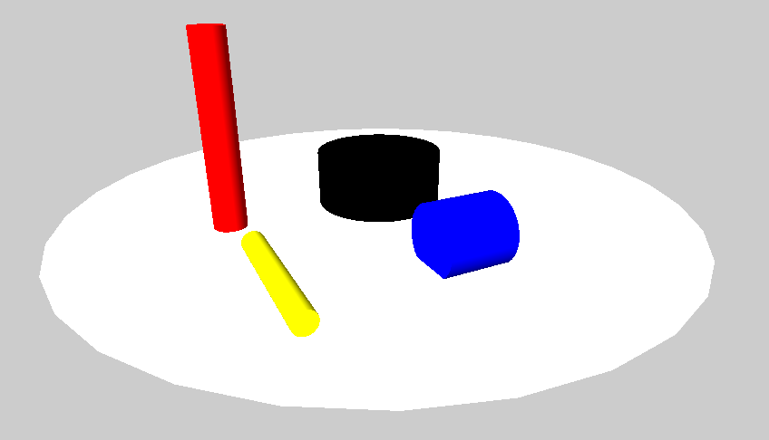

### Dome

Additional Values: radius, planes, samples

 | Name    | default value  | Description                                                                                 | Type  |
 |---------|----------------|---------------------------------------------------------------------------------------------|-------|
 |radius   | 1              |The Radius of the Dome.                                                                      |Double |
 |planes   | 1              |How rounded the Dome is at the sides.                                                        |Int    |
 |samples  | 4              |The samples. It means how round the Domes Ground is. So it´s more like a pyramid or a dome.  |Int    |

Look at the Picture to understand the influence of planes and samples.


Example:

```xml
<env:drawable3d objecttype="character" width="1" height="1" depth="1" x="5" y="0" z="5">
 <env:dome width="2" height="2" depth="2" planes="30" samples="30"  x="0" y="1.75" z="0" color="#C0C0C0"/> <!-- Grey one -->
 <env:dome width="1" height="2" depth="1"  radius="1" rotation="$deg45y" x="5" y="1.75" z="5" color="#FFFF00"/> <!-- Yellow one -->
 <env:dome width="2" height="1" depth="2"  samples="10" x="5" y="1.75" z="0" color="#0000FF"/> <!-- Blue one -->
 <env:dome width="1" height="1" depth="1" planes="10" radius="2" x="0" y="1.75" z="5" color="#FF0000"/> <!-- Red one -->
 <env:dome width="1" height="1" depth="1" samples="6" radius="2" x="3" y="1.75" z="7" color="#FF00FF"/> <!-- Turkis one -->
 <env:cylinder height="0.01"  radius="200" rotation="$deg90x" x="0" y="-2" z="0" color="#FFFFFF"/>
</env:drawable3d>
```


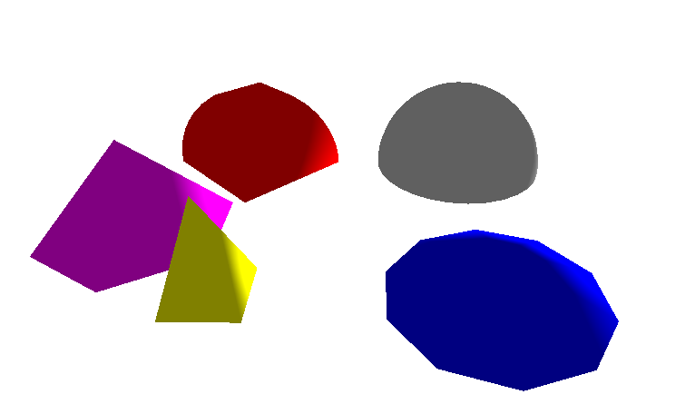

### Torus

Additional Values: outerRadius, innerRadius, circleSamples, radialSamples

 |Name           | default value  | Description                                                                                                    | Type|
 |---------------|----------------|----------------------------------------------------------------------------------------------------------------|-------|
 | outerRadius   |1               |The outer Radius                                                                                                |Double |
 | innerRadius   |0.1             |The inner Radius of the Torus-Ring                                                                              |Double |
 |circleSamples  |40              | How many Samples used for rendering the circle from the outer Radius. If set to 4 it is something like a cube  |Int    |
 |radialSamples  |20              |The Samples for the Torus-Ring                                                                                  |Int    |

Example:

```xml
<env:drawable3d objecttype="character" width="1" height="1" depth="1" x="5" y="5" z="5">
 <env:torus width="2" height="2" depth="2" innerRadius="0.1" outerRadius="2" circleSamples="4" radialSamples="4" x="0" y="3" z="0" color="#C0C0C0"/> <!-- Grey one 1-->
 <env:torus width="2.3" height="2.3" depth="2.3" innerRadius="0.1" outerRadius="2" circleSamples="8" radialSamples="4" x="0" y="3" z="-5" color="#FF00FF"/> <!-- Magenta one -->
 <env:torus width="2.7" height="2.7" depth="2.7" innerRadius="0.1" outerRadius="2" circleSamples="30" radialSamples="30" x="0" y="3" z="-10" color="#A0A0A0"/> <!-- Grey one 2-->
 <env:torus width="3" height="3" depth="10" innerRadius="0.1" outerRadius="2" circleSamples="30" radialSamples="30" x="0" y="3" z="-15" color="#FFFF00"/> <!-- Yellow one -->
 <env:torus width="3" height="3" depth="3" innerRadius="1" outerRadius="2" circleSamples="30" radialSamples="30" x="0" y="3" z="-25" color="#0000FF"/> <!-- Blue one -->
 <env:torus rotation="$deg90x" width="10" height="10" depth="10" innerRadius="0.02" outerRadius="2" circleSamples="90" x="0" y="3" z="-10" color="#FF0000"/> <!-- Red one -->
 <env:cylinder height="0.01"  radius="200" rotation="$deg90x" x="0" y="-5" z="0" color="#A0FFFF"/>
</env:drawable3d>
```


### Arrow

Additional Values: (none)

The Arrows are always one pixel wide. So the only thing you can set is the Direction (width, height, depth) and the origin Point(x,y,z).                 

Example:

```xml
<env:property name="rotate45" dynamic="false">new Vector3Double(0, (Math.PI/180)*45, 0)</env:property>
<env:box  width="100" height="0.1" depth="100" x="-50" y="-1" z="50" rotation="rotate45" color="#F0F0F0FF" shadowtype="Receive"/>
     
<env:arrow  width="0.01" height="0.2" depth="0" x="0" y="0" z="0" color="#FFFFFFFF"></env:arrow>
<env:arrow  width="0.2" height="0" depth="0.01" x="0" y="0" z="0" color="#FF00FFFF"></env:arrow>
<env:arrow  width="0" height="0.01" depth="0.2" x="0" y="0" z="0" color="#FFFF00FF"></env:arrow>

</env:drawable3d>
```


Working with Materials
-----------------------------------

A Geometry like all them above is just the shape of the object. The Engine cannot render a shape without knowing anything about its surface properties. You need to apply at least a color or better a texture to the surface to make them visible. Colors and textures are represented as Material objects. You can just add a color or one picure as Texture and the implementation creates the Material Object automatically.
If you want to have more influence and want to use complex Materials with Normal maps or shiness you have to create the Material files by yourself. But it is not complicated if you understand the mechanics.

### Simple Case: One Imagefile as Material

If you just want to change the "basic" look of an surface, just add an Picture (can be JPG or PNG) as Texture. You cant make any additional Settings to the Material like offset or how it is rendered on the Object. This way is only recommended for very basic objects.


```java

<env:box width="0.2" height="0.2" depth="0.2" color="#FFFFFFFF" texturepath="jadex3d/textures/solid/metalfloor.jpg"></env:box>

```


### Complex Case: Using Materials with .j3m Files

You can define small Textfiles with additional informations about the Materials. How this is working is perfectly described by the official JMonkey Tutorials here:
[JMonkey Materials Definition](http://hub.jmonkeyengine.org/wiki/doku.php/jme3:advanced:j3m_material_files)

In the Code you just Link to the Material File you Created.

```java
<env:box width="0.2" height="0.2" depth="0.2"  materialpath="jadex3d/textures/solid/Iron.j3m"></env:box>
```


In this small example we use a normal map to add some structure on the object without additional polygons.


```

Material Iron : Common/MatDefs/Light/Lighting.j3md {
     MaterialParameters {
        DiffuseMap : jadex3d/textures/solid/metalfloor.jpg
        NormalMap: jadex3d/textures/solid/metalfloor_normal3.jpg
        Specular : 1.0 1.0 1.0 1.0
        Diffuse : 1.0 1.0 1.0 1.0
        Ambient : 1.0 1.0 1.0 1.0
        GlowColor : 1.0 1.0 1.0 1.0
        VertexLighting : false
        UseMaterialColors : false
     }
     AdditionalRenderState {
      FaceCull Back
    }
}

```


With this as Result (You can see the NormalMap Effect):

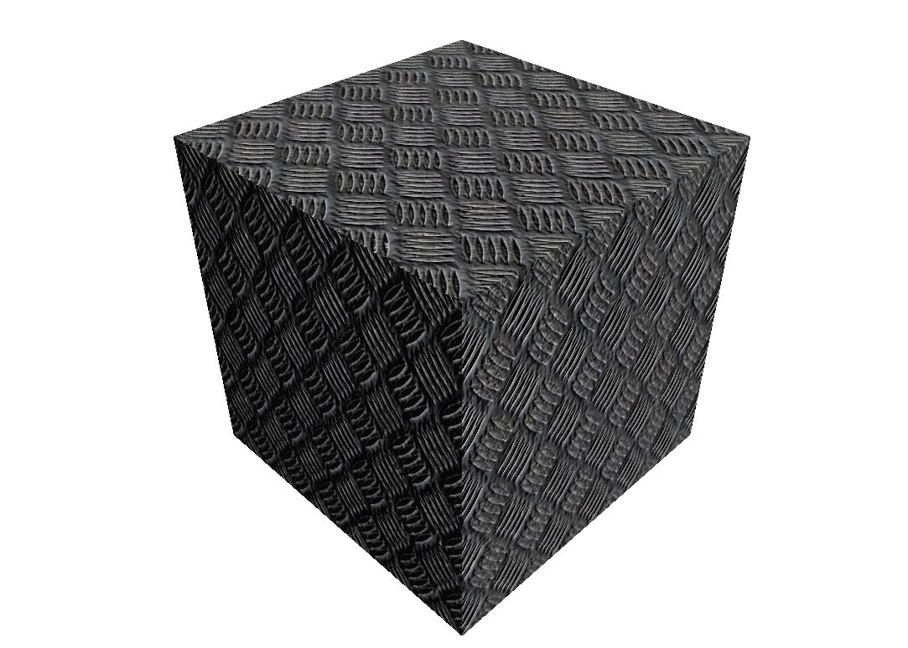

### Complex Case 2: Defening and using Materials with the jMonkey SDK

If you want to use the jMonkey SDK it is pretty simple to create complex j3me Files with an Wizard. Look into the jMonkey SDK Documentation (TODO) to see how this SDK can help you alot using it along with Eclipse.

Defining the Material:
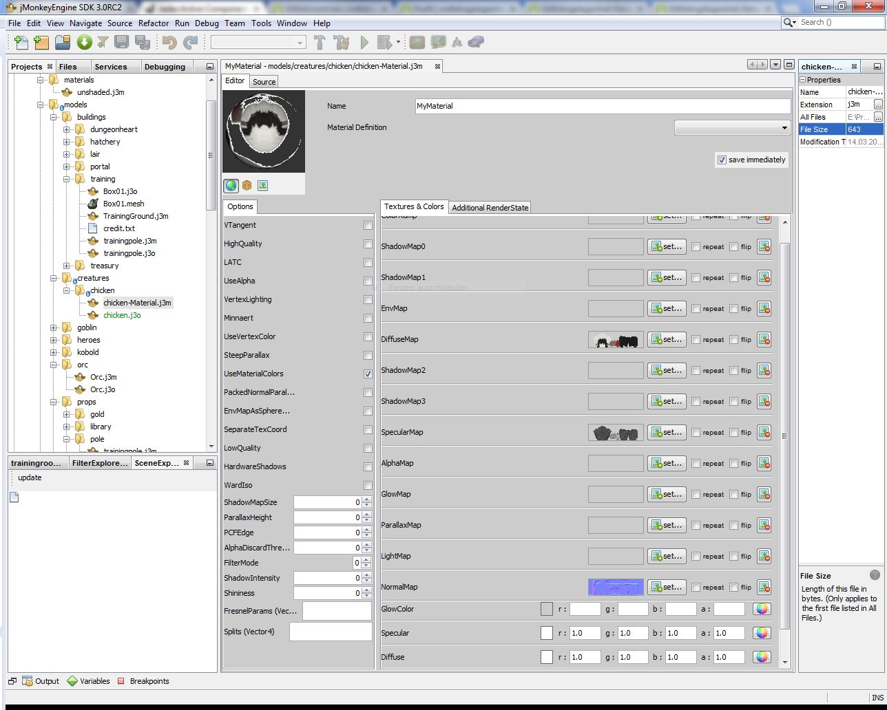

Adding it to an Asset:
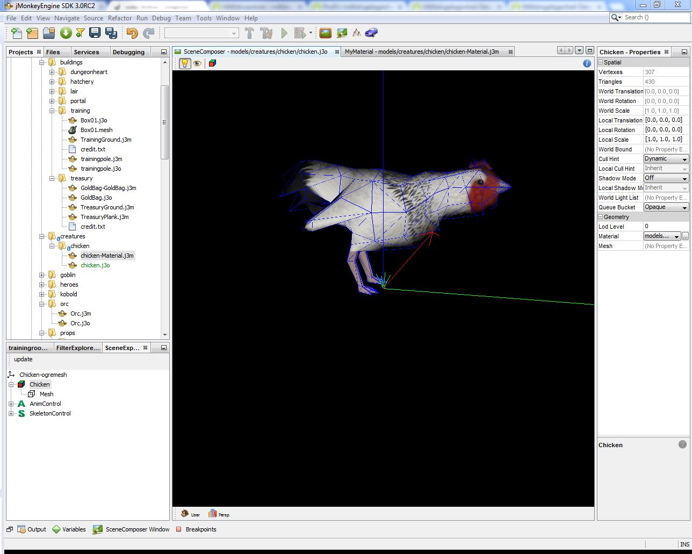


</div>

</div>

Working with complex 3d Objects
============================================

todo

3D Objects in general
----------------------------------

todo

JMonkey 3D Object Format
-------------------------------------

todo

Using 3D Objects in Jadex
--------------------------------------

todo

Working with Animations
------------------------------------

You create animated models for complex Objects with a tool such as Blender. Take some time and learn how to create your own models in Tutorials. If you downloaded a Model with Animations, the first step is to find out the Names of the Animation the model contains.

### Step 1: Finding the Animations Names

If you donwloaded a Model an have it in the correct .jme Format you can open the Model in the jMonkey SDK. You can see all Animations listed in the Scene Explorer Window. Click on the Animation-Control. For the Chicken we have the following Animations:
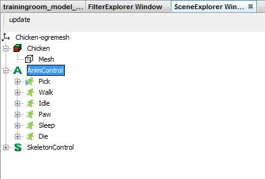
The Chicken play the Pick Animation:
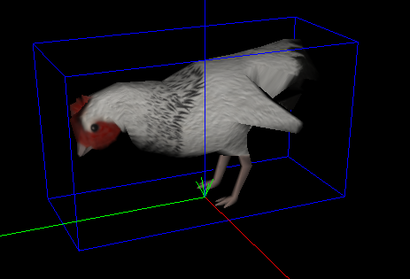

### Step 2: Using the Animations

Inside an object3d tag you can define Animations. For example if you just want to play the "idle" Animation from the chicken all the time, you can simply write this:

```xml

<env:animation name="Idle" channel="chanA" loop="true" speed="1.5"/>

```

You can choose different parameters:

| Name      | default value  | Description                                                  | Type    |
| ----------|----------------|--------------------------------------------------------------|---------|
|  name     |null            |The Name has the be the Same from Step 1                      |String   |
|  channel  |null            |Some models can have several Animations on differnt Channels  |String   |
|  loop     |true            |If you set this in false the Animation is only played once    |Boolean  |
|  speed    |1.0             |The Playback speed of the Animation                           |Integer  |

If you want to create more complex animation-logics you have to define an animationscondition. The next example show you how to use that. Its uses Properties from the Enivorment which are used and influenced by your Java code.

```xml

<env:drawable3d objecttype="chicken" width="1" height="1" depth="1">							
 <env:object3d width="0.6" height="0.6" depth="0.6" x="0" y="0" z="0" 
   modelpath="models/creatures/chicken/chicken.j3o"
   materialpath="models/creatures/chicken/chicken-Material.j3m"  >

  <env:animation name="Pick" channel="chanA" loop="true" speed="1.5">
    <env:animationcondition>$object.getProperty("status").equals("Pick")</env:animationcondition>
  </env:animation>

  <env:animation name="Idle" channel="chanA" loop="true" speed="1.5">
    <env:animationcondition>$object.getProperty("status").equals("Idle")</env:animationcondition>
  </env:animation>
							
  <env:animation name="Paw" channel="chanA" loop="true" speed="1.5">
    <env:animationcondition>$object.getProperty("status").equals("Paw")</env:animationcondition>
  </env:animation>

  <env:animation name="Sleep" channel="chanA" loop="true" speed="1.5">
    <env:animationcondition>$object.getProperty("status").equals("Sleeping")</env:animationcondition>
  </env:animation>

  <env:animation name="Walk" channel="chanA" loop="true" speed="2.5">
    <env:animationcondition>$object.getProperty("status").equals("Walk")</env:animationcondition>
  </env:animation>

 </env:object3d>
</env:drawable3d>

```


The Program sets the "status" Property. For example, if the chicken is moving, it sets the status on "Walk" and the Enviroment Triggers this status with the "Walk" animation because of the animationcondition.

This example can look like this in the 3d Enviroment, if you have lots of chickens who either walk or do randon animations.


</div>

</div>
