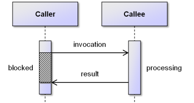

# Futures

In a typical method call, the caller is *blocked* waiting for the callee to finish it's processing. When the callee is done, the result is delivered to the caller. At this point, the caller gets unblocked and can continue with it's own program.
  


While the caller is blocked, it cannot perform any operations. To solve this, Jadex introduces *Futures*, which allow for asynchronous calls.  
After invocation, the callee returns a *Future*. The caller now has two options, shown in the figure below:


The options are:

- Block and wait for the result (left) by calling ```get()``` on the future
- Add a result listener (```addResultListener```) and continue (right)

Futures make it possible to perform asynchronous communication with local and/or remote components and services and are used throughout in Jadex Active Components.
For more information and motivation, please refer to [Asynchronous Programming](../guides/ac/03 Asynchronous Programming/).

# Working with Futures

TODO: Introduce Interface...

The typical case of working with futures is calling a method from the Jadex framework which returns a ```IFuture<>``` type.
In this case, you can either call *get()* on the future, which will block until the result is available, or **add a result listener**:

```java
IFuture<IComponentManagementService> fut = SServiceProvider.getService(access, IComponentManagementService.class);
fut.addResultListener(new DefaultResultListener<IComponentManagementService>() {
    public void resultAvailable(IComponentManagementService result) {
        // do your work with the result
    }
});
// do other, independent work
```

If you want or need a method to **return** a futurized result instead of a standard Java type, you can wrap it:

```java
public IFuture<String> getName() {
    return new Future<String>(name);
}
```

Most of the time, both cases will be combined, e.g., as asynchronous methods are called, the result of your computation will also be available asynchronously:

```java
public IFuture<String> getHelloString() {
    final Future<String> result = new Future<String>();
    IFuture<String> provName = nameProvider.getName();
    provName.addResultListener(new DefaultResultListener<String>() {
        public void resultAvailable(String name) {
            result.setResult("Hello, this is " + name);
        }
    });

    return result; // will be returned before setResult() is called!
}
```

<x-hint title="Futures and Void">
You can also wrap a *void* return type using IFuture<Void>.
This allows the callee to specify the point in time when it is ready by calling *setResult(null)* on the future.
</x-hint>

## Delegates
TODO

## Java 8 Features
TODO

## Types
ITuple2Future (create component result)

# Pitfalls

## No Error listener
TODO

## get() on main thread
TODO
As the thread running the main() method is not managed by the Jadex concurrency model there is another option. Using a so called *ThreadSuspendable*, the main thread can be blocked until the future is available. This technique avoids the necessity of inner classes, which comes with the use of result listeners. Note, that usage of the thread suspendable is only allowed when running on threads, which are not managed by Jadex. If you try to use the thread suspendable in Jadex threads, e.g. in component or service code, the system will probably run into deadlocks.


