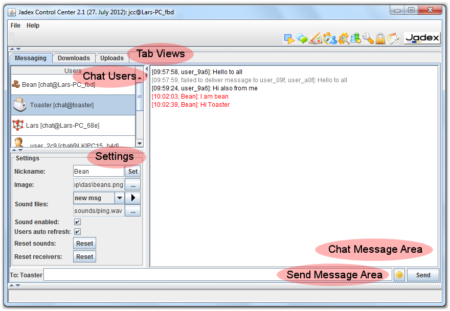
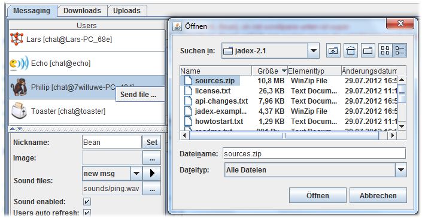

# Chat

*Screenshot of chat plugin*

The chat tool is a typical messenger style JCC plugin that can be used to exchange messages and files with other chat users. In contrast to other messengers like ICQ, Yahoo, or MSN, the Jadex chat is conceptually a peer-to-peer chat, i.e. one will see all those users online that have access to the same network. If global awareness is configured via the relay awareness, in principle one can see all other global users. The chat tool itself has three different tab views named **Messaging**, **Downloads**, and **Uploads**, which refer to sending/receiving text messages and binary files respectively.

Messaging
----------------------

The messaging view contains a **chat user list** in the upper left area, a **chat settings panel** on the lower left, a **chat message area** on the right and a** send message area** at the bottom of the window.

### Chat Users

The chat user list contains a list of the chat users currently online. Each user is displayed with an its **image**, **nickname**, and **component identifier**. The image and nickname can be changed in the settings panel below. The component identifier shows the id of the component hosting the chat service used. The chat user list is periodically refreshed and users that cannot be contacted any longer are first displayed as unconnected with an icon shown greyed. If still unconnected during the next refresh the user will be deleted from the list.

### Chat Settings

The chat settings panel allow to customize the chat behavior. Currently the following options are available:

-   **Nickname: **Can be used to change the user's nickname.
-   **Image: **Can be used to change** **user's image.
-   **Sound files: **Important chat events are underlayed with characteristic sounds that can be changed here. First, the event type should be selected using the choice box. The availble event types are **new msg** (message), **new user**, **msg failed**, **new file**, **file abort**, and **file complete**. Using the '...' button one can bring up a file chooser to select a new sound file. To test the new sound the play button  can be used.
-   **Sound enabled: **Enable or disable to turn on or off all notification sounds.
-   **Users auto refresh: **Enable or disable to turn on or off the auto refresh of the chat user list.
-   **Reset sounds: **Pressing the reset button will reload the default sounds settings.
-   **Reset receivers:** Pressing the reset button will set the chat receivers to 'all'. An alternative to change the receivers to all consists in deselecting one or more selected users by holding down ctrl and clicking the corresponding users in the chat user list.

### Send Message Area

In the send message text messages can be entered and sent to other users. On the left hand side the receivers of the text message are displayed. Per default a message is sent to all users currently online (To: all). If you want to send a private message to one or multiple chatters, you can select those from the chat user list (use shift or ctrl for multi selection). The names of the selected chatters will appear at the left hand side of the panel (such as in the screenshot above 'To: Toaster'). In the middle of the area the text message can be entered into the input field. If you want to use emoticons, you can either use the well known abbreviations, e.g. :-), or select a smiley direction from the corresponding choice on the right. The message will be sent by either pressing return directly in the input field or by hitting the 'Send' button. A message icon will be displayed next to each targeted user in the users list for indicating that message sending is in progress. If a message could not be sent to one of the target users, a corresponding note will be displayed in the message area.

File Transfer
--------------------------

File transfer is performed via a point to point connection between a sender an a receiver. To initiate a file transfer the receiver first has to be selected in the user list. Afterwards the 'send file' action can be used by activating the popup menu (as shown in the screenshot below). The action will open a file chooser to let the user select a file to be sent. On the receiver side a dialog is opened that a new file transfer has been initiated. The receiver can choose to accept or deny the file transfer request within some time interval. The user is presented the filename and size of the source file and can choose a local filename and storage directory. If no choice was made within the interval the transfer will automatically be rejected. In case of a successful transfer start, details about the transfer can be found in the downloads and uploads tab for each side.

*File upload via popup menu*

**

*File transfer acceptance dialog on receiver side*

### Downloads

In the downloads tab a table view of downloaded files is shown. The following columns are displayed:

-   **Name:** The filename that is used to save the file on the target.
-   **Path:** The local path for storing the file.
-   **Sender:** The origin of the file. The origin is identified by the component identifier of the source.
-   **Size:** The size of the file.
-   **Done:** The file portion already downloaded (in bytes, kb, MB).
-   **%:** The percentage of the file that already has been downloaded.
-   **State:** The state of the transmission. Is one of the following: waiting, rejected, transferring, cancelling, completed, aborted, error.
-   **Speed:** The current speed of the download.
-   **Remaining time:** The estimated remaining time given that the speed keeps rather constant.

*Download tab*

Depending on the state of the downloads different actions can be performed on them. All actions are available via popup menu. If the transfer is not finished yet the only available action will be 'Cancel transfer'. In case the transfer is not running any longer the available actions are 'Open', 'Open folder' and 'Remove'. The first option tries to interpret the file according to its file type, e.g. by starting a viewer for a pdf file and showing it.The second action tries to open the folder in which the downloaded file was stored and finally the thirst option removes the download entry from the list.

### Uploads

The uploads panel contains transfer information about uploaded files. The information that is shown the upload tab is equivalent to the one used in the download tab. Despite these similarities two natural differences exist. First, instead of the target file name and path, the original source file name and path are presented to user. Second, instead of the sender, the file receiver is shown.

*Upload tab*
