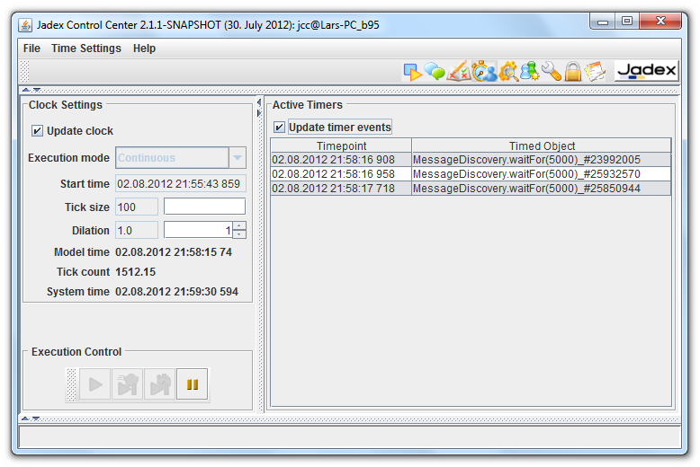

# Simulation Control

*Simulation control settings screenshot*

A fundamental concept realized in Jadex is **simulation transparency**, i.e. applications written in Jadex can be simulated or executed in real time without code changes. This is realized with a clock abstraction that is used for all timing aspects within an application. By exchanging the clock the timing behavior can be transparently changed. In the simulation control plugin, the clock type and its concrete settings can be defined. Looking at the screenshot above you can see that the simulation control panel consist of three main areas named **Clock Settings**, **Execution Control** and **Active Timers**, which are explained in the following.

Clock Settings
---------------------------

The clock settings area shows details of the clock currently used by the platform.

**Update clock:** If activated the clock settings are automatically updated.

**Execution mode:** The execution mode is determined by the clock type that is used. Please note that the clock time can be changed at runtime. For this purpose, first execution has to be paused by pressing the corresponding button from the execution control panel. Currently, the following clock types are available:

-   *System clock:* directly corresponds to the computer clock and delivers a time value that corresponds directly to Java *System.currentTimeMillis()*.
-   *Continuous clock*: similar to the system clock, but allows for pausing the clock and also using a dilation that makes the clock run faster of slower than the system clock.
-   *Event-driven clock: *The event-driven clock uses timing events to advance the clock value, i.e. components that register timing events determine how fast the model time advances. Using event-driven clock as-fast-as-possible simulations are possible, i.e. the whole computation time is used and no unnessary waiting times exist any longer.
-   *Time-driven clock: *The time-driven clock advances the model time by adding a constant (and definable) tick size. In this way the simulation time is advanced regularly which may lead to unnecessary time events, i.e. time points at which no component has something to do. On the other hand this simulation type leads to more realistic observable behavior as no irregular time jumps are produced.

**Start time:** The init time of the clock.

**Tick size:** The tick size is important for time-stepped simulations in which the tick size determines the time span between two clock ticks. In Jadex all clock types support ticks, i.e they emit a tick after the tick size amount of time has elapsed. In the field **Tick count** below the number of the current tick is shown. In components it is possible to use the *waitForTick()* method to get notified when the clock has advanced the next tick.

**Dilation:** The dilation describes the speed of the clock with respect to real time. Values greater one describe faster time progess while values lower than one indicate a clock slow down. New dilation values can be entered directly into the text field or by using the spinner. The spinner doubles / halves the current value when clicking up / down.

**Model time:** The model time is the time emitted by the clock. Depending on the clock type and its setting the model time can be completely different from real time. Model time is not advanced if the clock is paused.

**Tick count:** The number of the current tick. Important only if tick based waiting is used (as described above).

**System time:** The time of the built-in computer clock.

*Note:* Although all clock types are very similar from the interface they offer, there is a fundamental difference between simulation and normal clocks. Simulation clocks are passive in the sense that they do not advance time on their own. Instead, time advancement is triggered explicitly whenever all components have finished their execution with respect to the current point in time. In contrast, normal clocks are active and time automatically advances even if nothing else happens or if components are still busy.

Execution Control
------------------------------

The execution control field can be directly used to stop, resume, and step the currently used clock. The following buttons can be used:

-   : The start button allows for initially starting or resuming a previously paused clock.
-   : The step event button can be used with simulation clocks only. A paused clock can be forced to advance the clock to the next registered time point by pressing the button. As multiple events may have been registered for the same time point this action may not always cause the model time to advance,
-   : The step time button is also valid only for simulation clocks. It advances the clock to the next timepoint, i.e. it will activate all timing entries until one timing entry belongs to a time after those of the current clock reading.
-   : This button allows for pausing the active clock (the system clock cannot really be paused, but will stop triggering timing events). Having paused the clock applications that rely on timing will not execute further.

Active Timers
--------------------------

The list of active timers shows the registered timing events. This visualizes the next timer entries that will get executed by the clock. On the left hand side of the table the time point is given at which the timer will be fired and on the right hand side the object that will be executed is shown. As it costs resources to update the timer entry list the check box **Update timer events** can be used to turn off/on the automatic table refresh.
