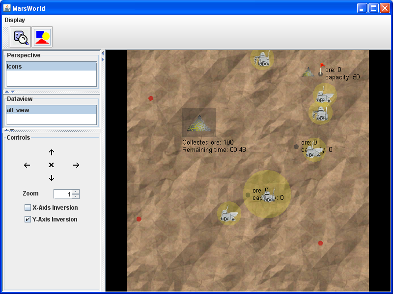

# Conclusion

We hope you enjoyed working through the tutorial and now are equipped at least with a basic understanding of the Jadex BDI reasoning engine. 
Nevertheless, this tutorial does not cover all important aspects about agent programming in Jadex.  
Most importantly the following topics have not been discussed:

# Goal Deliberation

This tutorial only mentioned the different goal types available in Jadex BDIV3 (perform, achieve, query and maintain). 
It does not cover aspects of goal deliberation, i.e. how a conflict free pursuit of goals can be ensured.  
Jadex offers the built-in *Easy Deliberation* strategy for this purpose. 
The strategy allows to constrain the *cardinality* of active goals. 
Additionally, it is possible to define *inhibition links* between goals that allow to establish an ordering of goals. 
Inhibited goals are suspended and can be reactivated when the reason for their inhibition has vanished, e.g. another goal has finished processing. 

# Plan Deliberation

If more than one plan is applicable for a given goal or event the Jadex interpreter has to decide which plan actually will be given a chance to handle the goal resp. event. 
This decision process called plan deliberation can be customized with *meta-level reasoning*.
This means that building the applicable plan list can be completely customized on the user level by using the ```@GoalAPLBuild``` annotation in a goal.  
Please have a look at the puzzle example (SokratesBDI) to see how it can be used.

**If you have any comments or improvement resp. extension proposals don't hesitate to contact us.**

# Example Projects
To learn more about Jadex BDIV3, please take a look at the application projects contained in the Jadex distribution.   
You can start them by loading the *jadex-application-bdiv3.jar* into the [JCC](../../../tools/01 Introduction/#from-jadex-distribution)).

The content of the new jar will be added as new node to the model tree on the left hand side.  
Next, you can expand the model tree by double clicking on the corresponding top-level node, which represents the jar-file. 
After openening the folders "jadex" and "examples" you will see the different example folders containing several different kinds of single- and multi-agent applications. Concretely the following BDI V3 example applications are currently available:

-   **Blocksworld:** Stacking blocks on a table to reach a specific target configuration of blocks.
-   **Cleanerworld:** Simulated cleaner robots collecting waste at day and patrolling at night.
-   **Garbagecollector:** Simplified version of the cleaner task using a grid world.
-   **Helloworld:** Very simple agent that prints "hello world" to the console output and then kills itself.
-   **Marsworld:** Cooperative exploitation of ore on mars by different kinds of robots.
-   **Puzzle:** An agent that tries to solve a puzzle by trying out moves and taking them possibly back.
-   **Shop:** Example for BDI with services. Buying virtual goods from seller agents.
-   **University:** Simple implementation of teaching example from the book "Developing Intelligent Agent Systems: A Practical Guide" written by L. Padgham and M. Winikoff.

Starting an example can in most cases be done by opening the corresponding folder and searching for an application file (a file ending with ".application.xml").
Such an application definition has the purpose to start-up all relevant application agents and may also setup further application components.  
In case there is no application file the example can be started by selecting the agent directly (e.g. HelloworldBDI or PuzzleBDI).

  
*The marsworld example*

### Explain example behaviour
 Choose one of the more complex examples (e.g. marsworld) for a more detailed analysis. 
 Select the application of the example and read through its documentation shown in the starter panel.
 Then look into the selected example directory and read also the documentation of the agents which belong to that application.  
 Finally, open the source code of these agents in your source code editor and try to grasp roughly of what they are comprised. 
 Write down a (simple!) explanation how the multi-agent system and the involved agents work.