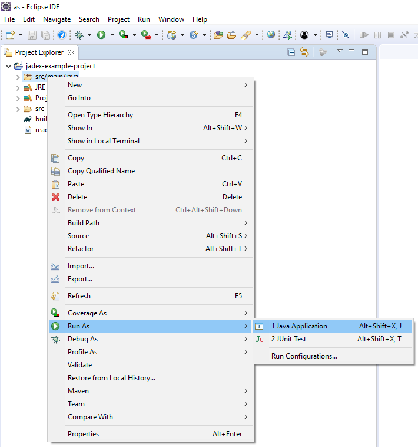
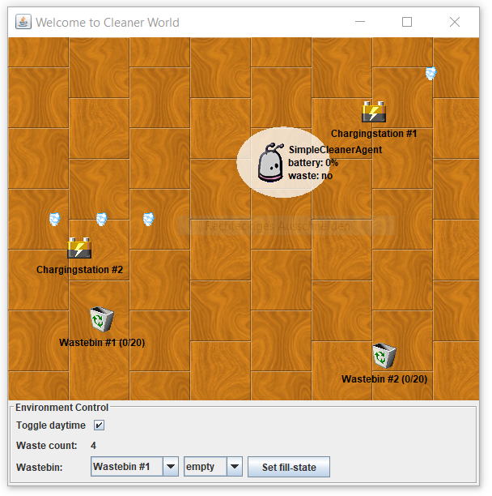
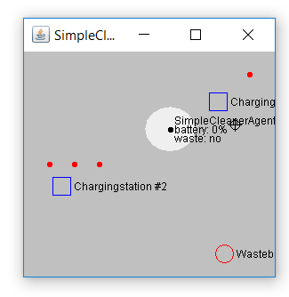

# Introduction

This tutorial introduces the notion of autonomous software agents by using a simulated environment named *Cleanerworld*. It illustrates some basic challenges for programming software agents and introduces the *BDI (belief-desire-intention)* model as implemented in Jadex. The tutorial is aimed at programmers with some basic Java experience. More advanced concepts like Java annotations are explained on the fly as needed. In addition, the tutorial provides many pointers to other documentation pages that you can follow if you want to learn a bit more about a certain topic.


# Setting up the Cleanerworld Project in Eclipse

The easiest way to start with the Cleanerworld scenario is to import the Jadex example project from the download server to an IDE of your choice. The following description explains the import process for the Eclipse IDE and the Gradle project support of Eclipse. You can download Eclipse from [https://www.eclipse.org/downloads/packages/installer](https://www.eclipse.org/downloads/packages/installer).


## Fetching the Project Files

Download the [jadex-example-project.zip](https://download.actoron.com/nightlies/oss/${jadexversiontitle/jadex-example-project.zip) and extract the contents to a directory of your choice. 


## Importing the Project

Choose *File/Import... -> Gradle/Existing Gradle Projects* and select the **unzipped** example directory as root directory.


*Figure 1: Eclipse import menu*


*Figure 2: Select the Gradle project type for import in Eclipse*

The import might take a while as Eclipse downloads several Jadex and 3rd party jar files (around 14 MB in total).


## Starting the Cleanerworld

To start the Cleanerworld application, open the imported project, right-click on the `src/main/java` folder and choose  *Run As -> Java Application*. Select the `Main` class from package `quickstart.cleanerworld`. Click *OK* and the application should start.
  


*Figure 3: Eclipse run-as menu*


*Figure 4: Selecting the Cleanerworld main class*

Eclipse remembers the launch configuration. Therefore in the future,
  you can simply select the *Main* configuration from the run history
  to start the program.


*Figure 5: Quick access to the created launch config*


## The `Main` Class and the Cleanerworld Environment

The `Main` class starts a Jadex platform with an initial agent and also opens a GUI of the cleanerworld.
You can use the mouse to place or remove *waste* objects directly in the environment view:



*Figure 6: Global view of the Cleanerworld environment*


In the `Main` class, the agent is started with the line:

```java
		conf.addComponent("quickstart/cleanerworld/SimpleCleanerAgent.class");
```

You can change this to start your own agents and/or duplicate the line to start multiple agents at once.
Further, you can use the `CLOCK_SPEED` setting to change the progress of time in the environment and thus
make the cleaner move faster or slower:


```java
	/** Use higher values (e.g. 2.0) for faster cleaner movement and lower values (e.g. 0.5) for slower movement. */
	protected static double	CLOCK_SPEED	= 1;
```


## A Simple Java Cleaner Agent (Exercise Zero)

The project contains a `SimpleCleanerAgent` that moves around in the Cleanerworld.
It uses the `SensorActuator` object that is available in the example project
for accessing the environment. Each agent has its local view of the environment,
which is based on a limited vision range as indicated by the semi-transparent circle around the cleaner:



The sensor/actuator is a helper object that provides access to the perception and the
available actions. It remembers seen objects and also notices their disappearence when in vision range.
Try placing/removing waste around the moving cleaner to understand the difference between the global
world view and the cleaners local (incomplete and possibly incorrect) knowledge.
 
More details about the sensor/actuator object can be found in the
[Javadoc](URLJavaDoc/index.html?jadex/quickstart/cleanerworld/environment/SensorActuator.html).

The simple cleaner is just a starting point that does not perceive anything and just moves randomly:

```java
		// Agent uses one main loop for its random move behavior
		while(true)
		{
			actsense.moveTo(Math.random(), Math.random());
		}
```

As a preliminary exercise in this tutorial, you could try to implement a cleaner in Java that:

* picks up waste,
* drops waste in a waste bin,
* recharges at a charging station before the battery is empty.

In the following exercises we will use features of the Jadex BDI model to build a more sophisticated agent step by step. 