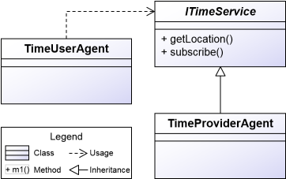

${SorryOutdatedv3}

# Introduction

This tutorial uses a small example use case to illustrate some basic features of Jadex without too much technical fuss. It is aimed at programmers with solid Java experience who like to "jump in" and quickly want to get something running. Furthermore the tutorial provides many pointers to other documentation pages that you can follow if you want to learn a bit more about a certain topic.

## Purpose of the Example Application

In this tutorial, a small distributed system will be built, in which time clients can subscribe to time servers for continuously receiving the current time of the server. Therefore time user components will search for available time provider components and subscribe to all providers they can find (see Fig.1a). The time providers remember the subscribed time user components. They then periodically (e.g. every 5 seconds) send their current time to all subscribed time users components (see Fig.1b).

a)   
b)   
*Figure 1: a) Time users subscribing to time providers, b) time providers publishing their current time to time users*

Although this application is quite simple, it contains several common challenges regarding the programming of distributed systems:

## Challenge 1: Discovery of distributed components

The time user components need to discover the available time provider components. This requires a) some form of service description, b) a way to publish service descriptions and c) a search mechanism for finding matching services in the network.

## Challenge 2: Components with internal behavior

The time providers need to periodically send out time values. Unlike purely passive servers like, e.g., static web applications, the server component requires some active internal behavior. In addition, concurrency between client requests and also with respect to internal behavior needs to be handled to assure consistency of the time provider's internal state.

## Challenge 3: Designing communication protocols

The communication between time user and time provider needs to be defined including, on the protocol level, the allowed sequences of messages and, on the application level, the data format for the transferred information.

## Challenge 4: Handling partial failures

Due to node or network failures, time user components may not always be able to correctly unsubscribe at the time providers. Thus time providers should automatically unsubscribe clients, which are no longer responding. Otherwise time providers would accumulate broken clients and quickly run into memory leaks. 

## Challenge 5: Security

Providing and accessing services across the Internet involves many security issues. E.g. potentially security critical services should by default be shielded from unauthorized access. On the other hand, no complicated security setup should be necessary for uncritical services like the time service. 

## Application Architecture

The architecture of the system is shown in Fig.2 as a UML class diagram. The time service interface is the central aspect of the design. The interface is used by the time user agent and it is implemented by the time provider agent. Time user and time provider do not know each other directly and only communicate through the time service interface.
In the following three chapters each of the three elements of the architecture will be explained in detail.

*Figure 2: UML class diagram of the time user / time provider system architecture*
